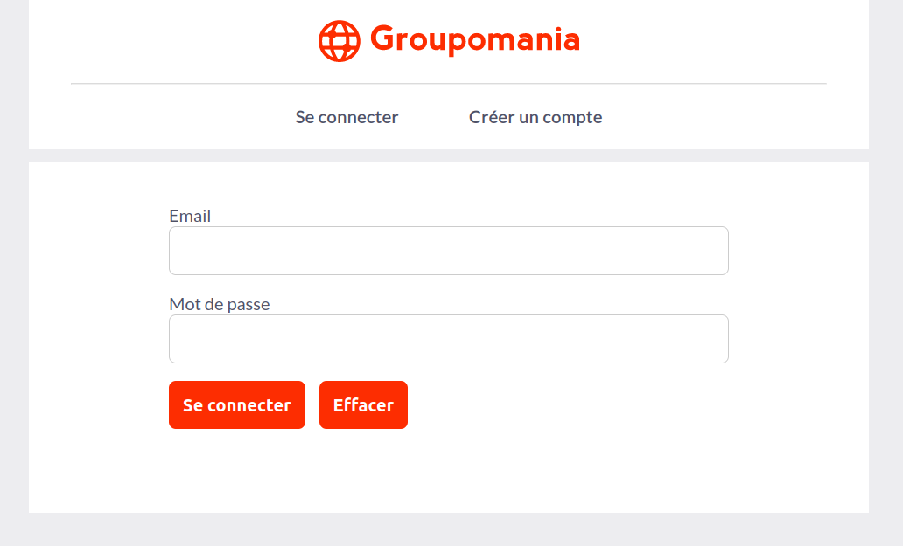
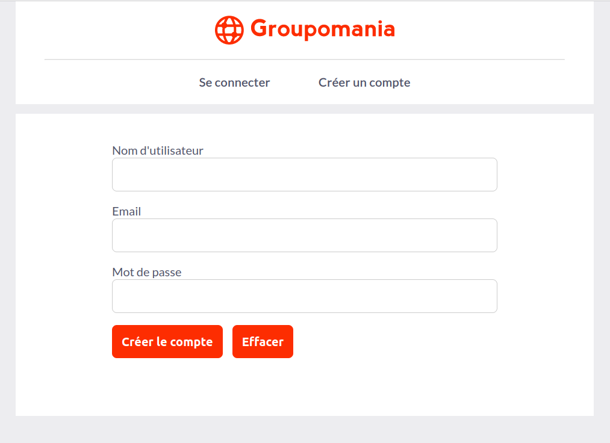
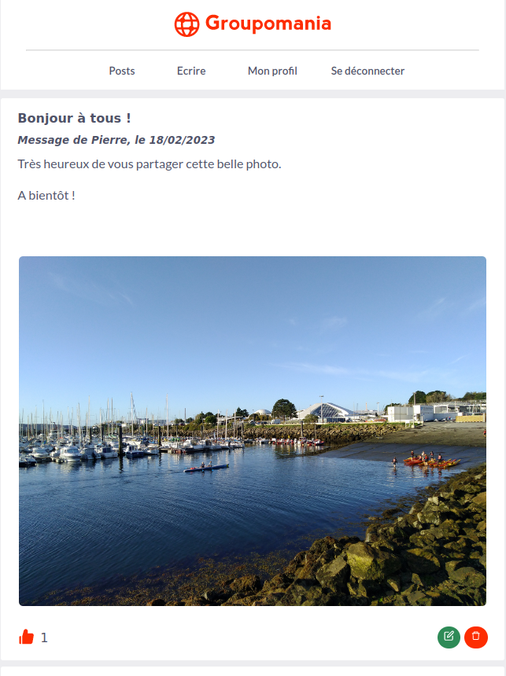
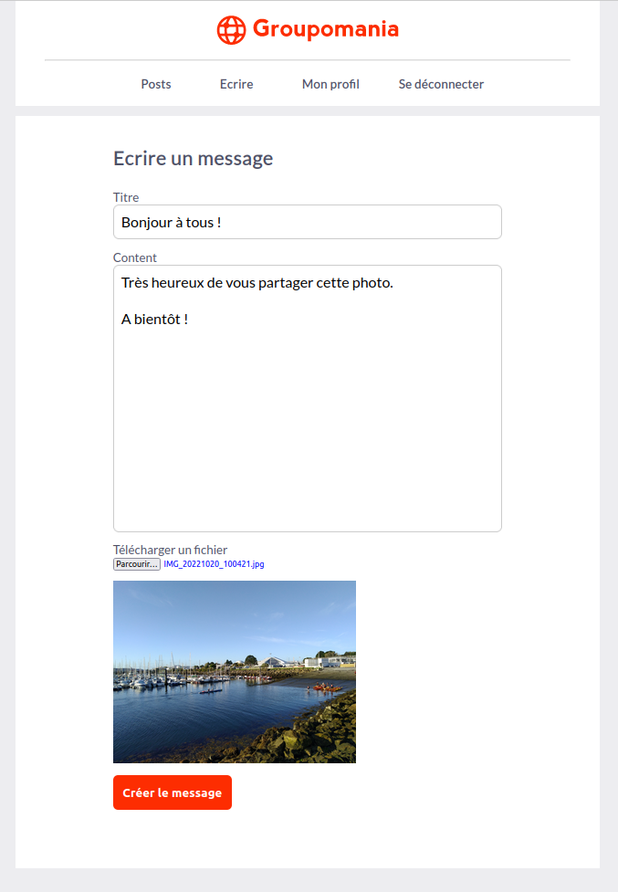
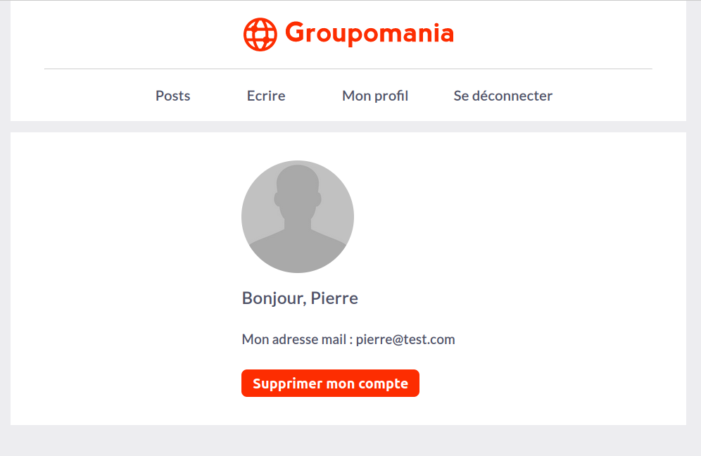

# Reseau social d'entreprise Groupomania

<h2>Description du projet</h2>

Le projet consiste à construire un réseau social interne pour les employés de Groupomania. Le
but de cet outil est de faciliter les interactions entre collègues. Le département RH de
Groupomania a imaginé plusieurs fonctionnalités pour favoriser les échanges entre collègues.

<h2>Spécifications fonctionnelles</h2>

### Page de connexion

Une page de connexion permettant à l’utilisateur de se connecter, ou bien
de créer un compte s’il n’en possède pas. Ici il faut demander le minimum
d’informations, la connexion doit se faire à partir de deux éléments : le mail
de l’employé, et un mot de passe. Rien de plus à prévoir pour le moment.

### Détails de la fonctionnalité de connexion

* Un utilisateur doit avoir la possibilité de se déconnecter.
* La session de l’utilisateur persiste pendant qu’il est connecté.
* Les données de connexion doivent être sécurisées.

### Page d’accueil

La page d’accueil doit lister les posts créés par les différents utilisateurs.
On voudra que les posts soient listés de façon antéchronologique (du plus
récent au plus ancien).

### Création d’un post

* Un utilisateur doit pouvoir créer un post.
* Un post doit pouvoir contenir du texte et une image.
* Un utilisateur doit aussi pouvoir modifier et supprimer ses posts.

### Système de like

Un utilisateur doit pouvoir liker un post, une seule fois pour chaque post.

### Rôle administrateur

Dans le but de pouvoir faire de la modération si nécessaire, il faudra créer
un utilisateur “administrateur” ; celui-ci aura les droits de modification /
suppression sur tous les posts du réseau social. Il faudra donc nous
communiquer les identifiants de cet administrateur.

## Identité graphique

Police d’écriture : tous les textes du site doivent utiliser la police Lato.
Couleurs : vous êtes libre sur les couleurs, mais voici notre palette actuelle
dont vous pouvez vous inspirer.
* Primaire : #FD2D01
* Secondaire : #FFD7D7
* Tertiaire : #4E5166

## Spécifications techniques

### Back-end

* Node Js
* Express
* Sequelize
* Mysql

<h3> Frond-end</h3>

* React Js
* Styled-components

<h2>Installation du projet</h2>

Pré-requis :
Node Js et Mysql doivent être installés sur la machine.

### Back-end

Installation du back-end
```bash
npm install
```
Importer le fichier truc.sql dans Mysql.

Lancement du back-end (port 3000)
```bash
npm start
```

### Front-end

Installation du front-end
```bash
npm install
```

Lancement du frond-end (port 3333)
```bash
npm start
```

<h2>Screenshots</h2>

***Page de connexion***

<br />

***Page de création de compte***

<br />

***Page des posts***

<br />

***Page de rédaction d'un post***

<br />

***Page du profil utilisateur***

<br />


